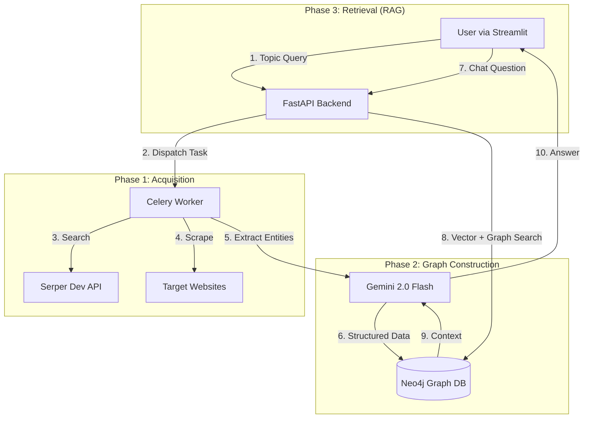

# 🕸️ GraphRAG Agent: Web Scraper + Knowledge Graph RAG

    

An autonomous RAG (Retrieval-Augmented Generation) pipeline that builds a structured Knowledge Graph from the web on-the-fly. Give it a topic (e.g., *"Agentic AI"*), and it searches Google, scrapes top websites, extracts entities/relationships using Gemini 2.0, builds a Neo4j graph, and lets you chat with the data.

---

## 📖 Table of Contents
- [✨ Features](#-features)
- [🏗️ System Architecture](#-system-architecture)
- [🛠️ Tech Stack](#-tech-stack)
- [🚀 Getting Started](#-getting-started)
  - [Prerequisites](#prerequisites)
  - [Environment Setup](#environment-setup)
  - [Running with Docker (Recommended)](#running-with-docker-recommended)
  - [Running Locally (Dev Mode)](#running-locally-dev-mode)
- [💻 Usage Guide](#-usage-guide)
- [🧠 Implementation Details](#-implementation-details)

---

## ✨ Features

* **Autonomous Ingestion:** Automatically searches Google (via Serper) and scrapes content from multiple URLs.
* **Smart Filtering:** Automatically detects and skips non-scrapable sources (e.g., Wikipedia) to preserve API quotas.
* **Structured Knowledge Graph:** Uses LLMs to extract specific nodes (`Concept`, `Person`, `Technology`) and relationships (`RELATES_TO`, `INVENTED_BY`) rather than simple vector chunks.
* **Production-Grade Extraction:**
    * **Schema Enforcement:** Eliminates generic "Chunk" nodes using `SchemaLLMPathExtractor`.
    * **Rate Limit Protection:** Custom throttling logic handles Gemini Free Tier limits (5 RPM).
    * **Robustness:** Retry logic with exponential backoff for network stability.
* **Context-Aware RAG:** Retrieves connected sub-graphs to answer complex user queries with high accuracy.
* **Interactive UI:** Streamlit frontend with scraping controls, system health checks, and chat history.

---

## 🏗️ System Architecture

The system consists of three main phases executed via an asynchronous pipeline:


---

## 🛠️ Tech Stack

| Component | Technology | Description |
|-----------|-----------|-------------|
| Language | Python 3.11 | Core application logic. |
| Orchestration | Celery + Redis | Asynchronous task queue for scraping pipelines. |
| Database | Neo4j (v5.26+) | Property Graph Database for knowledge storage. |
| AI / LLM | Google Gemini 2.0 | Entity extraction & Chat generation (via google-genai). |
| Framework | LlamaIndex | Orchestrating Graph RAG and Vector Indexing. |
| Backend | FastAPI | High-performance API for frontend communication. |
| Frontend | Streamlit | Interactive user interface for control and chat. |
| Search | Serper Dev | Google Search API wrapper. |

---

## 🚀 Getting Started

### Prerequisites

- Docker & Docker Compose (Recommended for DBs)
- Python 3.11+ (If running workers locally)
- API Keys:
  - `GOOGLE_API_KEY`: Get from [Google AI Studio](https://makersuite.google.com/app/apikey).
  - `SERPER_API_KEY`: Get from [Serper.dev](https://serper.dev).

### Environment Setup

1. Clone the repository:
```bash
git clone https://github.com/your-username/graph-rag-agent.git
cd graph-rag-agent
```

2. Create a `.env` file in the root directory:
```env
# --- PROJECT SETTINGS ---
PROJECT_NAME=web-rag-scraper
PYTHON_VERSION=3.11

# --- AI & SEARCH ---
GOOGLE_API_KEY=<your_google_api_key>
SERPER_API_KEY=<your_serper_api_key>

# --- POSTGRESQL (Relational DB) ---
POSTGRES_USER=<your_postgres_user>
POSTGRES_PASSWORD=<your_postgres_password>
POSTGRES_DB=<your_database_name>
POSTGRES_PORT=5432

# --- NEO4J (Graph DB) ---
NEO4J_USER=<your_neo4j_user>
NEO4J_PASSWORD=<your_neo4j_password>
NEO4J_HTTP_PORT=7474
NEO4J_BOLT_PORT=7687
# Memory settings for production (adjust based on your RAM)
NEO4J_dbms_memory_heap_initial__size=1G
NEO4J_dbms_memory_heap_max__size=2G

# --- REDIS (Cache & Queue) ---
REDIS_PORT=6379
REDIS_HOST=127.0.0.1
```

### Running with Docker (Recommended)

This starts Neo4j, Redis, and PostgreSQL in isolated containers.

1. Start the infrastructure:
```bash
docker-compose up -d
```

2. Wait 30 seconds for Neo4j to initialize.

3. Access Neo4j Browser at http://localhost:7474 (Auth: `neo4j` / `password123`).

### Running Locally (Dev Mode)

To debug code or run the Scraper/LLM logic on your host machine:

1. **Install Dependencies:**
```bash
poetry install
# OR
pip install -r requirements.txt
```

2. **Start the Celery Worker:**

   **Note:** On Windows, the `--pool=solo` flag is mandatory to prevent deadlocks.
```bash
# Windows
poetry run celery -A app.workers.celery_app worker --loglevel=info --pool=solo

# Linux/Mac
poetry run celery -A app.workers.celery_app worker --loglevel=info
```

3. **Start the Backend API:**
```bash
poetry run uvicorn app.main:app --reload
```

4. **Start the Frontend:**
```bash
poetry run streamlit run streamlit_app.py
```

---

## 💻 Usage Guide

1. **Open the App:** Navigate to http://localhost:8501.

2. **Ingest Data:**
   - In the sidebar, type a topic (e.g., "Generative AI").
   - Use the slider to select how many websites to scrape (Start with 2-3).
   - Click **🚀 Start Ingestion Pipeline**.

3. **Monitor:** Watch the Celery logs. You will see:
   - `Searching Google...`
   - `Scraping URLs...`
   - `🔌 Connecting to Graph DB...`
   - `✅ Successfully ingested...`

4. **Chat:** Once ingestion finishes, use the main chat window to ask questions like *"What are the key concepts of Generative AI?"*.

---

## 🧠 Implementation Details

### 1. The "Chunk" Node Fix
**Problem:** Standard LlamaIndex extractors often fail to match regex patterns, resulting in generic "Chunk" nodes.

**Solution:** We use `SchemaLLMPathExtractor` with a strict set of `VALID_NODES` (Concept, Person, etc.) and `VALID_RELATIONS`. This forces the LLM to output structured JSON that maps perfectly to the graph schema.

### 2. Rate Limit Handling (The "Crash" Fix)
**Problem:** Google Gemini's Free Tier allows only 5 Requests Per Minute (RPM).

**Solution:** A hard throttle (`time.sleep(15)`) is implemented in the `SyncGeminiLLM` class. While this slows down ingestion, it guarantees the pipeline completes without `ResourceExhausted` errors.

### 3. Windows & Celery Compatibility
**Problem:** Celery's default prefork pool is unstable on Windows.

**Solution:** We force the worker to run in solo mode (`--pool=solo`) and explicitly set the `WindowsProactorEventLoopPolicy` for asyncio compatibility.

### 4. Graph Schema
The graph is strictly typed to ensure high-quality retrieval:

- **Nodes:** `Concept`, `Person`, `Organization`, `Technology`, `Event`.
- **Relationships:** `RELATES_TO`, `INVENTED_BY`, `USED_BY`, `PART_OF`, `WORKED_AT`.

---